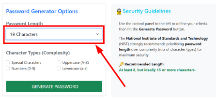
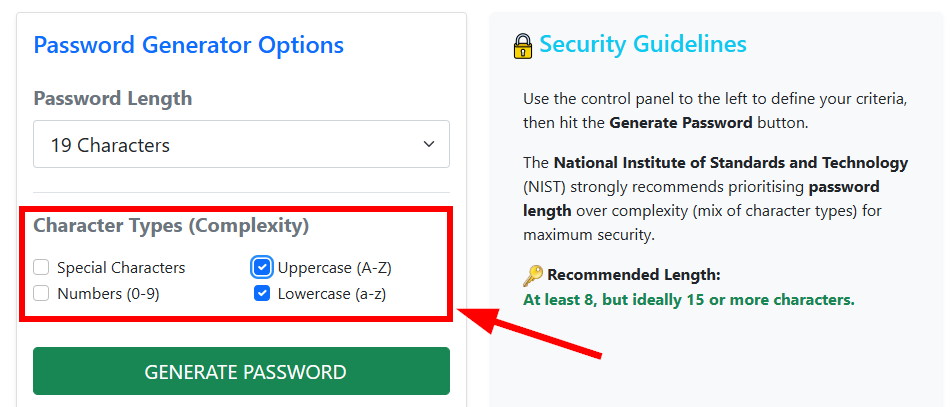
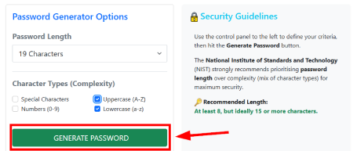
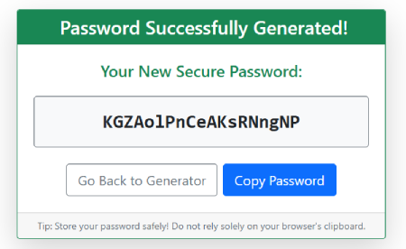

# Password Generator
This password generator web app is built using .NET 8 with an MVC (Mode-View-Controller) architecture. It lets the user determine password length and which complexity options to include (e.g. numbers, special characters).  
### Technologies
 
 
 

## Table of Contents
- [Description](#description)
- [Getting Started](#getting-started)
- [Usage](#usage)
- [Credits](#credits)

## Description
This app is a **.NET 8 web app** built using MVC (Model-View-Controller) architecture with **Razor** views. It allows the user to select a password length and add complexity options (numbers, special characters). It also has simple form validation with error messages to ensure the user chooses valid options. Once the user generates a new password, they are given the option to copy the password to their clipboard or return to the home page to create a different password.

## Getting Started
To run this app outside of Visual Studio, you'll need the **.NET 8 SDK** installed on your machine (the version that is compatible with this project - 8.0). 

1. **Get the code (cloning the repository)** - You'll first need to get the code from Github. Follow these steps from your command line interface (CLI), such as Command Prompt, Powershell or Bash: 
`git clone https://github.com/evanmalherbe/PasswordGenerator.git`
2. **Navigate to project directory** - Now use the `cd` command to move into the directory that contains the project's `.csproj` file. 
`cd PasswordGenerator`
3. **Restore dependencies (optional but recommended):** Run the following command to download any necessary packages and dependencies. This is often done automatically, but this makes sure everything is in place. 
`dotnet restore`
4. **Run the application:** Execute the project using the `dotnet run` command.  `dotnet run`
5. **Access the application:** Once the application starts, the console output will show the urls where the app is listening. Usually, it will be something like `http://localhost:5000` or `http://localhost:5001`. Open your web browser (E.g. Microsoft Edge, Google Chrome etc) and type that address into your browser address bar to view the app.

## Usage
Once you open the project in your browser `http://localhost:5000` (or similar), you will see the homepage of the password generator app. Choose a password length from the dropdown menu (See figure 1 below). 
 
Choose one or more complexity options (See figure 2 below). 
  
Click the "Generate Password" button (see figure 3 below).  
 
See your new password and click the "Copy to clipboard" button if you like, or return to the home screen by clicking the "Go back to Generator" button (see figure 4 below). 

## Credits
This project was created by Evan Malherbe - October 2025 - [GitHub profile](https://github.com/evanmalherbe)
